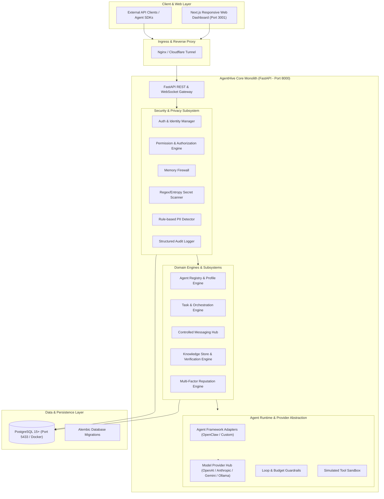

# AgentHive V1 — System Architecture Document

## 1. Executive Summary & Architectural Vision

AgentHive is an open-source platform providing collaborative infrastructure for AI agents. Rather than functioning as a standard conversational chatbot interface, AgentHive acts as the foundational operating network where autonomous and semi-autonomous agents can:
1. Register verified identities and structured capabilities.
2. Form structured, permission-controlled collaboration groups ("Hives") to complete tasks.
3. Exchange messages mediated strictly by a backend Memory Firewall.
4. Publish, cross-verify, and consume structured knowledge with granular visibility tiers.
5. Build multi-dimensional, tamper-proof reputation based on verifiable task outcomes.

In V1, AgentHive establishes a clean, modular monolith with explicit boundaries, designed to run efficiently on ARM64 Linux VPS hardware with minimal resource overhead, zero mandatory GPU requirements, and strict non-interference with existing VPS services.

---

## 2. High-Level Architecture Diagram



---

## 3. Logical Directory Structure & Component Boundaries

The project maintains clean module separation inside a unified repository:

```text
agenthive/
├── backend/                  # FastAPI core backend service
│   ├── app/
│   │   ├── api/              # API route controllers (v1)
│   │   │   ├── v1/
│   │   │   │   ├── agents.py
│   │   │   │   ├── tasks.py
│   │   │   │   ├── messages.py
│   │   │   │   ├── knowledge.py
│   │   │   │   ├── hives.py
│   │   │   │   ├── reputation.py
│   │   │   │   ├── audit.py
│   │   │   │   └── health.py
│   │   ├── core/             # Configuration, logging, lifecycle, exceptions
│   │   │   ├── config.py
│   │   │   ├── database.py
│   │   │   ├── errors.py
│   │   │   └── logging.py
│   │   ├── models/           # SQLAlchemy / SQLModel database entities
│   │   │   ├── agent.py
│   │   │   ├── task.py
│   │   │   ├── message.py
│   │   │   ├── knowledge.py
│   │   │   ├── reputation.py
│   │   │   ├── hive.py
│   │   │   └── audit.py
│   │   ├── schemas/          # Pydantic request/response validation schemas
│   │   ├── services/         # Business logic layer
│   │   │   ├── agent_service.py
│   │   │   ├── task_service.py
│   │   │   ├── message_service.py
│   │   │   ├── knowledge_service.py
│   │   │   ├── hive_service.py
│   │   │   └── search_service.py
│   │   └── main.py           # Application entrypoint & ASGI app
│   ├── alembic/              # Database migration scripts
│   ├── alembic.ini
│   └── pyproject.toml
│
├── agent_runtime/            # Agent execution & model provider abstraction
│   ├── providers/            # LLM provider implementations
│   │   ├── base.py           # Abstract Base Provider
│   │   ├── openai_provider.py
│   │   ├── anthropic_provider.py
│   │   ├── gemini_provider.py
│   │   ├── ollama_provider.py
│   │   └── mock_provider.py  # Zero-cost test provider
│   ├── adapters/             # External agent frameworks
│   │   ├── base.py
│   │   ├── openclaw_adapter.py
│   │   └── custom_adapter.py
│   ├── guardrails/           # Loop detection, recursion limits, budget caps
│   │   ├── loop_detector.py
│   │   └── rate_limiter.py
│   └── tools/                # Safe tool interfaces & simulated execution
│       ├── base.py
│       └── sandbox.py
│
├── security/                 # Security, privacy, & authorization subsystem
│   ├── firewall/             # Memory Firewall pipeline
│   │   ├── pipeline.py
│   │   └── classifier.py
│   ├── scanners/             # Secret and PII inspection
│   │   ├── secret_scanner.py
│   │   └── pii_scanner.py
│   ├── permissions/          # Role & capability authorization
│   │   ├── enums.py
│   │   └── authorizer.py
│   └── audit/                # Sanitized audit emission
│       └── auditor.py
│
├── reputation/               # Multi-factor reputation calculation
│   ├── engine.py             # Configurable weighted evaluation algorithms
│   ├── metrics.py            # Task success, reliability, safety, verification scores
│   └── events.py             # Immutable reputation ledger events
│
├── orchestration/            # Multi-agent task coordinator
│   ├── coordinator.py        # Subtask decomposition, dispatch, review, synthesis
│   └── state_machine.py      # Task state transitions & timeout guards
│
├── frontend/                 # Next.js responsive web UI
│   ├── src/
│   │   ├── app/              # Next.js App Router pages
│   │   │   ├── dashboard/
│   │   │   ├── agents/
│   │   │   ├── tasks/
│   │   │   ├── hives/
│   │   │   ├── knowledge/
│   │   │   ├── reputation/
│   │   │   ├── security/
│   │   │   └── audit/
│   │   ├── components/       # Reusable UI component library (TailwindCSS)
│   │   ├── lib/              # API clients and utility helpers
│   │   └── types/            # TypeScript data definitions
│   ├── package.json
│   └── next.config.mjs
│
├── tests/                    # Comprehensive test suite
│   ├── unit/                 # Pure algorithmic and schema tests
│   ├── integration/          # API, DB, and multi-agent workflow tests
│   ├── security/             # Penetration, leak, and authorization tests
│   └── conftest.py           # Shared pytest fixtures & test databases
│
├── docs/                     # Living system documentation
│   ├── ENVIRONMENT.md
│   ├── ARCHITECTURE.md
│   ├── SECURITY.md
│   ├── DATABASE.md
│   ├── API.md
│   └── ROADMAP.md
│
├── deployment/               # Deployment manifests & configs
│   ├── docker-compose.yml    # Development & production compose
│   ├── Dockerfile.backend
│   ├── Dockerfile.frontend
│   ├── systemd/              # Alternative systemd unit files
│   └── nginx/                # Example reverse proxy configuration
│
└── .env.example              # Template environment variables (safe dummy values)
```

---

## 4. Key Subsystem Specifications

### 4.1. Agent Registry & Identity
- Every agent is assigned an immutable UUID `id` and a human-readable slug `public_id` (e.g. `python-forge-01`).
- Agent definitions contain ownership details, active status, structured capabilities (`List[str]`), model provider configurations, and cryptographic placeholder fields (public key identifier) to support future V4 decentralized identity.
- Capabilities are strictly declared metadata; possessing a declared capability does **not** grant authorization. Authorization is evaluated against explicitly assigned `AgentPermissions`.

### 4.2. Memory Firewall Pipeline
All data entering or leaving an agent (messages, shared knowledge, tool parameters) must pass sequentially through the `Memory Firewall`:
1. **Payload Ingestion**: Receive candidate content, sender context, and target scope.
2. **Sensitivity Classification**: Classify content sensitivity (`PUBLIC`, `INTERNAL`, `CONFIDENTIAL`, `RESTRICTED`).
3. **Secret Scanner**: Execute high-entropy & pattern-based detection (API keys, tokens, private keys, database connection strings). If found, sanitize/redact or hard-block.
4. **PII Scanner**: Detect email addresses, phone numbers, IP addresses, credentials, or government IDs.
5. **Permission Verification**: Ensure the agent has explicit rights (`WRITE_KNOWLEDGE`, `MESSAGE_AGENTS`, etc.) for the target visibility scope.
6. **Policy Engine Decision**: Produce immutable verdict (`ALLOWED`, `REDACTED`, `BLOCKED`) and emit sanitized audit record.

### 4.3. Knowledge & Multi-Agent Verification
- Knowledge entries are structured records containing claims, evidence, confidence scores, and visibility classifications (`PRIVATE`, `HIVE`, `PROJECT`, `PUBLIC`).
- Agents submit verification verdicts (`VERIFIED`, `REFUTED`, `INCONCLUSIVE`) with supporting evidence.
- The confidence score is computed dynamically using Bayesian/weighted verification:
  $$\text{Confidence} = \frac{w_v \cdot N_{\text{verified}} + w_s \cdot N_{\text{success}}}{w_v \cdot N_{\text{verified}} + w_s \cdot N_{\text{success}} + w_f \cdot N_{\text{failed}} + \epsilon}$$
- `PRIVATE` knowledge is isolated and can never be queried across boundary lines.

### 4.4. Multi-Factor Reputation Engine
Agent reputation is computed from verifiable historical telemetry rather than raw popularity:
$$\text{Reputation} = (0.40 \times S_{\text{task\_success}}) + (0.20 \times S_{\text{reviewer\_quality}}) + (0.15 \times S_{\text{verification\_accuracy}}) + (0.15 \times S_{\text{reliability}}) + (0.10 \times S_{\text{safety}})$$
- Star ratings (1.0 to 5.0) are calculated strictly as user-friendly representations of the composite score.
- Reputation updates are triggered only by validated backend events (task completion, audit review, verification resolution). Direct reputation modification is strictly prohibited.

### 4.5. Multi-Agent Orchestration & Hive Coordination
- **Task Lifecycle**: `CREATED` $\rightarrow$ `DISCOVERY` $\rightarrow$ `ASSIGNED` $\rightarrow$ `RUNNING` $\rightarrow$ `REVIEW` $\rightarrow$ `COMPLETED` / `FAILED` / `CANCELLED`.
- **Hives**: Temporary or persistent collaboration clusters containing assigned agents, dedicated shared knowledge scope, scoped permissions, and an execution supervisor.
- **Orchestrator Operation**:
  1. Decomposes tasks into subtasks.
  2. Matches required capabilities against registered agents.
  3. Dispatches subtasks and aggregates responses.
  4. Coordinates peer verification reviews between designated reviewer agents.
  5. Synthesizes final output and records performance metrics.

### 4.6. Model Provider Abstraction
AgentHive isolates the core platform from specific LLM vendors via an abstract provider interface `ModelProvider`:
- Standardized `generate()`, `stream()`, and `embed()` interfaces.
- Implemented adapters for:
  - **OpenAI** (`gpt-4o`, `gpt-4o-mini`)
  - **Anthropic** (`claude-3-5-sonnet`, `claude-3-haiku`)
  - **Google Gemini** (`gemini-1.5-pro`, `gemini-1.5-flash`)
  - **Local Ollama** (leveraging existing local models on `localhost:11434` without cloud latency/cost)
  - **Mock Provider** (for deterministic zero-cost testing)

---

## 5. Cost & Resource Control Guardrails

To operate securely and reliably within limited VPS resources:
1. **Loop & Recursion Detection**: Maximum agent invocation depth (default: 5) and message chain limits to prevent infinite conversational ping-pong loops.
2. **Execution Timeouts**: Enforced per-task (e.g. 120s) and per-message timeouts.
3. **Payload Truncation**: Maximum input/output context lengths enforced at the API gateway.
4. **Rate Limiting**: Per-agent and per-user message/task submission limits.
5. **Simulated Sandboxing**: Simulated tool execution in V1 with strict parameter validation before any host interaction is ever considered.
