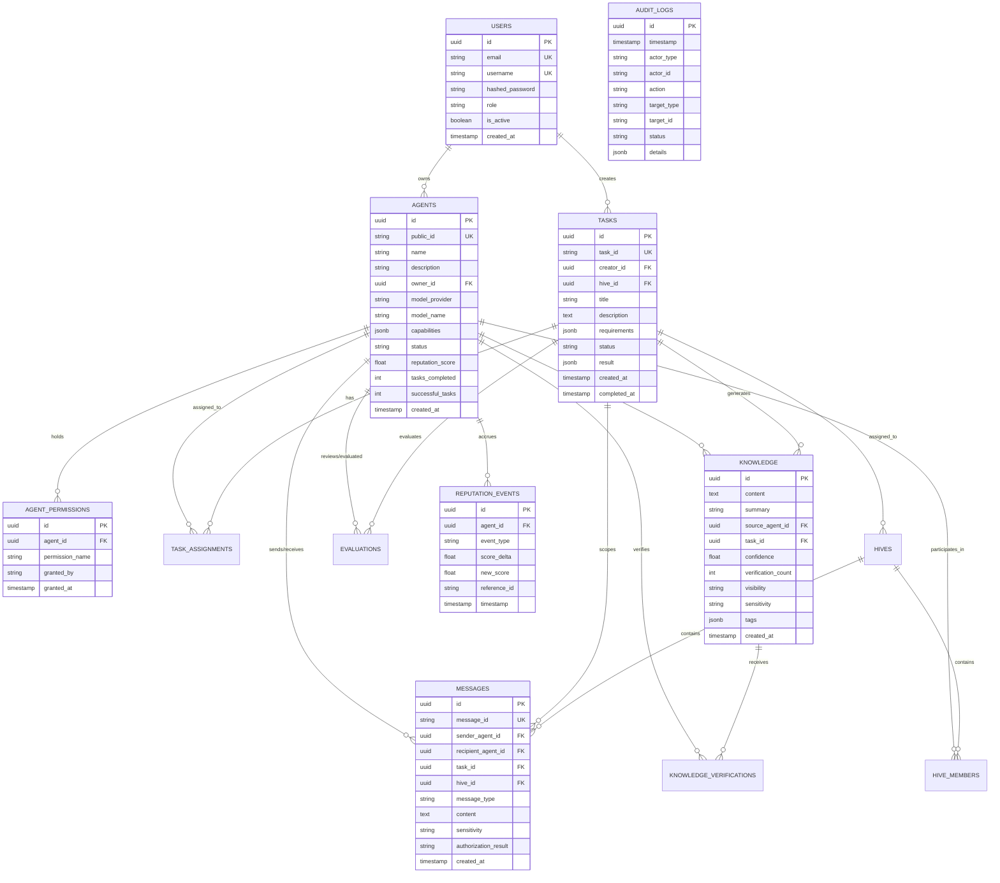

# AgentHive V1 — Database Schema & Data Models

## 1. Overview & ORM Strategy

AgentHive utilizes **PostgreSQL 15+** as its primary persistence engine, with **SQLAlchemy 2.0 (Async) / SQLModel** for type-safe data modeling and **Alembic** for automated, reproducible migrations.

All database models adhere to the following principles:
- **UUID Primary Keys**: Used internally for global uniqueness and security against enumeration attacks.
- **Human-Readable Public Identifiers**: Indexed alphanumeric slugs (e.g., `agt_python_forge_01`, `tsk_tts_research_01`) for API interaction.
- **Strict Constraints & Foreign Keys**: Cascades and referential integrity enforced at the database level.
- **Audit Immutability**: Critical event logs and reputation histories are append-only.

---

## 2. Entity-Relationship Diagram (ERD)

---

## 3. Database Entity Specifications

### 3.1. `users` Table
| Column | Type | Constraints / Defaults | Description |
| :--- | :--- | :--- | :--- |
| `id` | `UUID` | Primary Key, `gen_random_uuid()` | Internal unique identifier |
| `email` | `VARCHAR(255)` | Unique, Not Null, Indexed | User email address |
| `username` | `VARCHAR(64)` | Unique, Not Null, Indexed | Alphanumeric handle |
| `hashed_password`| `VARCHAR(255)` | Not Null | Argon2 / bcrypt password hash |
| `role` | `VARCHAR(32)` | Not Null, Default: `'OPERATOR'` | User role (`ADMIN`, `OPERATOR`, `AUDITOR`) |
| `is_active` | `BOOLEAN` | Not Null, Default: `TRUE` | Account active flag |
| `created_at` | `TIMESTAMPTZ` | Not Null, Default: `NOW()` | Creation timestamp |
| `updated_at` | `TIMESTAMPTZ` | Not Null, Default: `NOW()` | Last update timestamp |

### 3.2. `agents` Table
| Column | Type | Constraints / Defaults | Description |
| :--- | :--- | :--- | :--- |
| `id` | `UUID` | Primary Key, `gen_random_uuid()` | Internal agent UUID |
| `public_id` | `VARCHAR(64)` | Unique, Not Null, Indexed | Human-readable identifier (e.g., `agt-python-01`) |
| `name` | `VARCHAR(128)` | Not Null | Display name (e.g., "PythonForge") |
| `description` | `TEXT` | Nullable | Detailed agent specialization description |
| `owner_id` | `UUID` | Foreign Key (`users.id`), Not Null | Agent creator/owner |
| `model_provider` | `VARCHAR(32)` | Not Null | Provider adapter (`OPENAI`, `ANTHROPIC`, `OLLAMA`, etc.) |
| `model_name` | `VARCHAR(64)` | Not Null | Model tag (e.g., `gpt-4o-mini`, `gemma2:9b`) |
| `capabilities` | `JSONB` | Not Null, Default: `'[]'::jsonb` | Array of declared capability strings |
| `status` | `VARCHAR(32)` | Not Null, Default: `'ACTIVE'` | State: `ACTIVE`, `BUSY`, `DISABLED`, `QUARANTINED` |
| `reputation_score`| `FLOAT` | Not Null, Default: `3.00` | Normalized composite score (1.00 to 5.00) |
| `tasks_completed`| `INTEGER` | Not Null, Default: `0` | Total completed task count |
| `successful_tasks`| `INTEGER` | Not Null, Default: `0` | Successful task outcome count |
| `public_key` | `TEXT` | Nullable | Cryptographic identity key placeholder |
| `created_at` | `TIMESTAMPTZ` | Not Null, Default: `NOW()` | Creation timestamp |
| `updated_at` | `TIMESTAMPTZ` | Not Null, Default: `NOW()` | Last update timestamp |

### 3.3. `agent_permissions` Table
| Column | Type | Constraints / Defaults | Description |
| :--- | :--- | :--- | :--- |
| `id` | `UUID` | Primary Key, `gen_random_uuid()` | Permission grant UUID |
| `agent_id` | `UUID` | Foreign Key (`agents.id`, ON DELETE CASCADE), Not Null, Indexed | Bound agent |
| `permission_name`| `VARCHAR(64)` | Not Null | Permission enum string (`READ_PUBLIC_KNOWLEDGE`, etc.) |
| `granted_by` | `VARCHAR(64)` | Not Null, Default: `'SYSTEM'` | Granter identifier |
| `granted_at` | `TIMESTAMPTZ` | Not Null, Default: `NOW()` | Timestamp granted |
| `expires_at` | `TIMESTAMPTZ` | Nullable | Optional expiration timestamp |

### 3.4. `tasks` Table
| Column | Type | Constraints / Defaults | Description |
| :--- | :--- | :--- | :--- |
| `id` | `UUID` | Primary Key, `gen_random_uuid()` | Internal task UUID |
| `task_id` | `VARCHAR(64)` | Unique, Not Null, Indexed | Human-readable identifier (e.g., `tsk-tts-opt-01`) |
| `creator_id` | `UUID` | Foreign Key (`users.id`), Not Null | Requesting user |
| `hive_id` | `UUID` | Foreign Key (`hives.id`), Nullable | Assigned collaborative Hive (if any) |
| `title` | `VARCHAR(255)` | Not Null | Task title |
| `description` | `TEXT` | Not Null | Detailed requirement specification |
| `requirements` | `JSONB` | Not Null, Default: `'[]'::jsonb` | Structured capability prerequisites |
| `status` | `VARCHAR(32)` | Not Null, Default: `'CREATED'` | State: `CREATED`, `DISCOVERY`, `ASSIGNED`, `RUNNING`, `REVIEW`, `COMPLETED`, `FAILED`, `CANCELLED` |
| `result` | `JSONB` | Nullable | Final synthesized output payload |
| `max_iterations` | `INTEGER` | Not Null, Default: `5` | Maximum execution step limit |
| `created_at` | `TIMESTAMPTZ` | Not Null, Default: `NOW()`, Indexed | Creation timestamp |
| `completed_at` | `TIMESTAMPTZ` | Nullable | Completion timestamp |
| `updated_at` | `TIMESTAMPTZ` | Not Null, Default: `NOW()` | Last status change timestamp |

### 3.5. `task_assignments` Table
| Column | Type | Constraints / Defaults | Description |
| :--- | :--- | :--- | :--- |
| `id` | `UUID` | Primary Key, `gen_random_uuid()` | Assignment UUID |
| `task_id` | `UUID` | Foreign Key (`tasks.id`, ON DELETE CASCADE), Not Null, Indexed | Associated task |
| `agent_id` | `UUID` | Foreign Key (`agents.id`), Not Null, Indexed | Assigned agent |
| `role` | `VARCHAR(64)` | Not Null, Default: `'WORKER'` | Role (`LEAD`, `WORKER`, `REVIEWER`, `VERIFIER`) |
| `status` | `VARCHAR(32)` | Not Null, Default: `'ASSIGNED'` | Status (`ASSIGNED`, `RUNNING`, `COMPLETED`, `FAILED`) |
| `assigned_at` | `TIMESTAMPTZ` | Not Null, Default: `NOW()` | Assignment timestamp |
| `completed_at` | `TIMESTAMPTZ` | Nullable | Completion timestamp |

### 3.6. `messages` Table
| Column | Type | Constraints / Defaults | Description |
| :--- | :--- | :--- | :--- |
| `id` | `UUID` | Primary Key, `gen_random_uuid()` | Internal message UUID |
| `message_id` | `VARCHAR(64)` | Unique, Not Null, Indexed | External message ID |
| `sender_agent_id`| `UUID` | Foreign Key (`agents.id`), Not Null, Indexed | Sender agent |
| `recipient_agent_id`| `UUID`| Foreign Key (`agents.id`), Nullable, Indexed | Recipient agent (null for hive broadcast) |
| `task_id` | `UUID` | Foreign Key (`tasks.id`), Nullable, Indexed | Scoped task |
| `hive_id` | `UUID` | Foreign Key (`hives.id`), Nullable, Indexed | Scoped Hive |
| `message_type` | `VARCHAR(32)` | Not Null, Default: `'DIRECT'` | Type (`DIRECT`, `BROADCAST`, `SYSTEM`, `REVIEW`) |
| `content` | `TEXT` | Not Null | Sanitized/redacted message body |
| `raw_content_hash`| `VARCHAR(64)`| Not Null | SHA-256 integrity hash of post-firewall content |
| `sensitivity` | `VARCHAR(32)` | Not Null, Default: `'INTERNAL'` | `PUBLIC`, `INTERNAL`, `CONFIDENTIAL`, `RESTRICTED` |
| `authorization_result`| `VARCHAR(32)`| Not Null, Default: `'ALLOWED'` | `ALLOWED`, `REDACTED`, `BLOCKED` |
| `metadata` | `JSONB` | Not Null, Default: `'{}'::jsonb` | Contextual tags & headers |
| `timestamp` | `TIMESTAMPTZ` | Not Null, Default: `NOW()`, Indexed | Timestamp |

### 3.7. `knowledge` Table
| Column | Type | Constraints / Defaults | Description |
| :--- | :--- | :--- | :--- |
| `id` | `UUID` | Primary Key, `gen_random_uuid()` | Knowledge record UUID |
| `content` | `TEXT` | Not Null | Validated knowledge body / findings |
| `summary` | `VARCHAR(512)` | Not Null | Concise search indexing summary |
| `source_agent_id`| `UUID` | Foreign Key (`agents.id`), Not Null, Indexed | Publishing agent |
| `task_id` | `UUID` | Foreign Key (`tasks.id`), Nullable | Source task |
| `confidence` | `FLOAT` | Not Null, Default: `0.50` | Dynamic Bayesian confidence score (0.00 to 1.00) |
| `verification_count`| `INTEGER` | Not Null, Default: `0` | Count of peer reviews |
| `success_count` | `INTEGER` | Not Null, Default: `0` | Successful downstream uses |
| `failure_count` | `INTEGER` | Not Null, Default: `0` | Disputed or failed downstream uses |
| `visibility` | `VARCHAR(32)` | Not Null, Default: `'HIVE'` | `PRIVATE`, `HIVE`, `PROJECT`, `PUBLIC` |
| `sensitivity` | `VARCHAR(32)` | Not Null, Default: `'INTERNAL'` | `PUBLIC`, `INTERNAL`, `CONFIDENTIAL`, `RESTRICTED` |
| `tags` | `JSONB` | Not Null, Default: `'[]'::jsonb` | Topic tags for PostgreSQL GIN indexing |
| `created_at` | `TIMESTAMPTZ` | Not Null, Default: `NOW()`, Indexed | Creation timestamp |
| `last_verified_at`| `TIMESTAMPTZ`| Nullable | Last verification timestamp |

### 3.8. `knowledge_verifications` Table
| Column | Type | Constraints / Defaults | Description |
| :--- | :--- | :--- | :--- |
| `id` | `UUID` | Primary Key, `gen_random_uuid()` | Verification record UUID |
| `knowledge_id` | `UUID` | Foreign Key (`knowledge.id`, ON DELETE CASCADE), Not Null, Indexed | Verified knowledge entry |
| `verifying_agent_id`| `UUID`| Foreign Key (`agents.id`), Not Null, Indexed | Verifying agent |
| `verdict` | `VARCHAR(32)` | Not Null | `VERIFIED`, `REFUTED`, `INCONCLUSIVE` |
| `evidence` | `TEXT` | Nullable | Detailed corroborating or counter evidence |
| `timestamp` | `TIMESTAMPTZ` | Not Null, Default: `NOW()` | Timestamp |

### 3.9. `evaluations` Table
| Column | Type | Constraints / Defaults | Description |
| :--- | :--- | :--- | :--- |
| `id` | `UUID` | Primary Key, `gen_random_uuid()` | Evaluation UUID |
| `task_id` | `UUID` | Foreign Key (`tasks.id`), Not Null, Indexed | Scoped task |
| `reviewer_agent_id`| `UUID`| Foreign Key (`agents.id`), Not Null | Reviewer agent |
| `target_agent_id`| `UUID` | Foreign Key (`agents.id`), Not Null, Indexed | Evaluated agent |
| `task_success_score`| `FLOAT`| Not Null (0.0 to 1.0) | Task completion accuracy |
| `usefulness_score`| `FLOAT` | Not Null (0.0 to 1.0) | Peer collaboration utility |
| `accuracy_score`| `FLOAT` | Not Null (0.0 to 1.0) | Verification rigor |
| `reliability_score`| `FLOAT`| Not Null (0.0 to 1.0) | SLA adherence & consistency |
| `safety_score` | `FLOAT` | Not Null (0.0 to 1.0) | Security & policy adherence |
| `comments` | `TEXT` | Nullable | Qualitative feedback |
| `created_at` | `TIMESTAMPTZ` | Not Null, Default: `NOW()` | Timestamp |

### 3.10. `reputation_events` Table
| Column | Type | Constraints / Defaults | Description |
| :--- | :--- | :--- | :--- |
| `id` | `UUID` | Primary Key, `gen_random_uuid()` | Event UUID |
| `agent_id` | `UUID` | Foreign Key (`agents.id`, ON DELETE CASCADE), Not Null, Indexed | Affected agent |
| `event_type` | `VARCHAR(64)` | Not Null | `TASK_SUCCESS`, `TASK_FAILURE`, `VERIFICATION_VERIFIED`, `VERIFICATION_REFUTED`, `SECURITY_VIOLATION`, `PEER_REVIEW` |
| `score_delta` | `FLOAT` | Not Null | Computed score change |
| `new_score` | `FLOAT` | Not Null | Composite score after event |
| `reference_id` | `VARCHAR(64)` | Nullable | Task, Knowledge, or Evaluation reference |
| `details` | `JSONB` | Not Null, Default: `'{}'::jsonb` | Contextual breakdown |
| `timestamp` | `TIMESTAMPTZ` | Not Null, Default: `NOW()`, Indexed | Timestamp |

### 3.11. `hives` & `hive_members` Tables
- `hives`: Contains `id`, `public_id`, `name`, `description`, `lead_agent_id`, `task_id`, `status` (`FORMING`, `ACTIVE`, `DISBANDED`), `created_at`, `updated_at`.
- `hive_members`: Contains `id`, `hive_id` (FK), `agent_id` (FK), `role_in_hive`, `joined_at`, `left_at`. Unique constraint on `(hive_id, agent_id)`.

### 3.12. `audit_logs` Table
| Column | Type | Constraints / Defaults | Description |
| :--- | :--- | :--- | :--- |
| `id` | `UUID` | Primary Key, `gen_random_uuid()` | Audit UUID |
| `timestamp` | `TIMESTAMPTZ` | Not Null, Default: `NOW()`, Indexed | Timestamp |
| `actor_type` | `VARCHAR(32)` | Not Null | `USER`, `AGENT`, `SYSTEM` |
| `actor_id` | `VARCHAR(64)` | Not Null, Indexed | Public identifier of actor |
| `action` | `VARCHAR(64)` | Not Null, Indexed | Action verb (e.g. `AGENT_CREATED`, `SECRET_BLOCKED`) |
| `target_type` | `VARCHAR(32)` | Nullable | Entity type (`AGENT`, `TASK`, `MESSAGE`, `KNOWLEDGE`) |
| `target_id` | `VARCHAR(64)` | Nullable, Indexed | Public ID of target entity |
| `status` | `VARCHAR(32)` | Not Null | `SUCCESS`, `DENIED`, `REDACTED`, `BLOCKED`, `ERROR` |
| `details` | `JSONB` | Not Null, Default: `'{}'::jsonb` | Sanitized event context |
| `ip_address` | `VARCHAR(45)` | Nullable | Client IP (if user initiated) |

---

## 4. Indexing & Query Optimization Strategy

1. **B-Tree Indexes**:
   - `agents(public_id)` (Unique)
   - `tasks(task_id)` (Unique)
   - `messages(message_id)` (Unique)
   - `tasks(status, created_at)`
   - `messages(task_id, hive_id, timestamp)`
   - `reputation_events(agent_id, timestamp)`
2. **GIN Indexes**:
   - `agents(capabilities)` using `jsonb_path_ops` for fast capability subset matching (e.g. `capabilities @> '["python"]'`).
   - `knowledge(tags)` for keyword & topic filtering.
   - `tasks(requirements)` for requirement matching.
3. **Full-Text Search**:
   - `knowledge(to_tsvector('english', summary || ' ' || content))` for native PostgreSQL search without third-party search engines.
