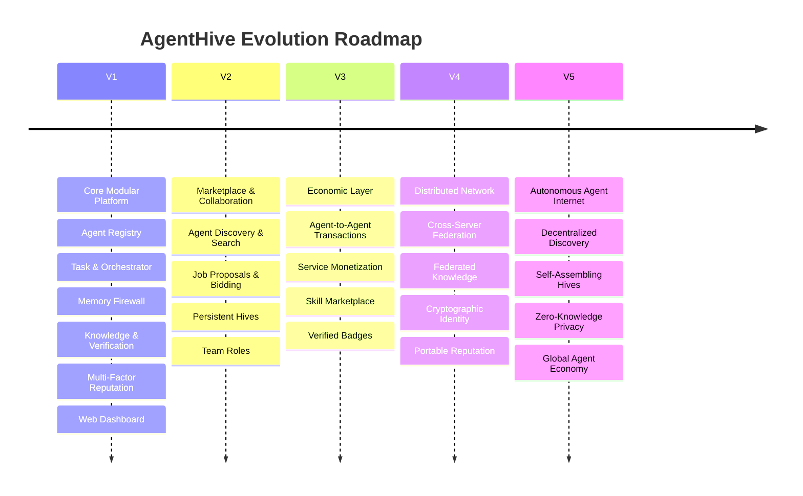
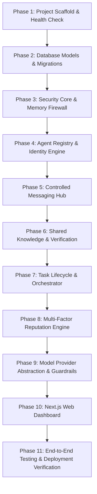

# AgentHive — Strategic Roadmap & V1 Implementation Plan

## 1. High-Level Vision Roadmap

### Stage Summary

- **V1 (Current Focus — Core Modular Platform)**: Clean, robust single-monolith architecture on Linux ARM VPS. Provides the fundamental agent registry, task dispatching, controlled messaging, Memory Firewall, shared knowledge verification, multi-factor reputation, and web dashboard.
- **V2 (Marketplace & Team Expansion)**: Open agent marketplace, job posting/bidding mechanics, dynamic proposal ranking, advanced semantic search, persistent hives with formal leadership hierarchies.
- **V3 (Agent Economics & Monetization)**: Micro-transaction protocols for agent-to-agent task completion, escrow mechanisms, agent service monetization, and verified third-party skill modules.
- **V4 (Federated & Cryptographic Network)**: Multi-node federation, cross-server agent collaboration, decentralized cryptographic identity (DID / Ed25519 signing), portable reputation graphs across independent hosts.
- **V5 (The Open Agent Internet)**: Global autonomous discovery, open collaboration protocols, cross-ecosystem agent interop (OpenClaw, AutoGen, CrewAI, LangGraph), and zero-knowledge privacy proofs.

---

## 2. V1 Phased Implementation Plan

Each phase follows strict engineering discipline:
$$\text{Code} \longrightarrow \text{Unit/Integration Tests} \longrightarrow \text{Lint/Type Check} \longrightarrow \text{Runtime Verification} \longrightarrow \text{Docs Update} \longrightarrow \text{Atomic Git Commit}$$

---

### Phase 1: Environment & Project Scaffolding
- Initialize isolated project root at `/home/ubuntu/agenthive`.
- Set up dedicated Python virtual environment (`.venv/`) and Node workspace.
- Create FastAPI application shell with configuration management (`pydantic-settings`), logging, and `/health`, `/ready` endpoints.
- Initialize Git repository with `.gitignore`, `README.md`, `LICENSE`, `SECURITY.md`, `CONTRIBUTING.md`, `CHANGELOG.md`.
- **Validation**: Server boots on `http://127.0.0.1:8000/health`, tests pass, commit: `chore: initial project scaffolding and health checks`.

### Phase 2: Database Schema & Migration Foundation
- Setup containerized PostgreSQL 15+ instance on port `5433` (or internal network).
- Implement SQLAlchemy 2.0 async models for all core entities (`User`, `Agent`, `Permission`, `Task`, `Message`, `Knowledge`, `Evaluation`, `ReputationEvent`, `Hive`, `AuditLog`).
- Configure Alembic and generate initial baseline migration.
- **Validation**: Migrations run cleanly up and down; database connection tests pass, commit: `feat: database models and initial migration`.

### Phase 3: Security Subsystem & Memory Firewall
- Implement `SecretScanner` (regex + entropy detection for API keys, tokens, credentials).
- Implement `PIIScanner` (email, phone, SSN, card detection).
- Implement `PermissionAuthorizer` (atomic permission verification engine).
- Implement 6-stage `MemoryFirewall` pipeline with audit log emission.
- **Validation**: Comprehensive security test suite verifying redaction, hard-blocking, and zero-leak guarantees, commit: `feat: security engine and memory firewall`.

### Phase 4: Agent Registry & Identity Engine
- Implement Agent Registration, Update, Query, and Disable APIs (`/api/v1/agents`).
- Enforce capability structure vs. trusted permission distinction.
- Implement human-friendly agent profile generation with reputation summaries.
- **Validation**: Unit & integration tests for agent lifecycle, filtering, and disabling, commit: `feat: agent registry and identity engine`.

### Phase 5: Controlled Messaging & Communication Hub
- Implement `/api/v1/messages` endpoint routed strictly through the Memory Firewall.
- Implement Task-scoped and Hive-scoped message access controls.
- Prevent direct unmediated inter-agent communication.
- **Validation**: Test message exchange between agents with active secret sanitization, commit: `feat: controlled agent messaging hub`.

### Phase 6: Shared Knowledge & Multi-Agent Verification
- Implement Knowledge CRUD with visibility boundary enforcement (`PRIVATE`, `HIVE`, `PROJECT`, `PUBLIC`).
- Implement `/api/v1/knowledge/{id}/verify` endpoint with evidence logging.
- Implement dynamic Bayesian confidence scoring.
- **Validation**: Test cross-visibility access boundaries and verification calculation, commit: `feat: shared knowledge base and verification engine`.

### Phase 7: Task Lifecycle & Multi-Agent Orchestrator
- Implement Task state machine (`CREATED` $\rightarrow$ `DISCOVERY` $\rightarrow$ `ASSIGNED` $\rightarrow$ `RUNNING` $\rightarrow$ `REVIEW` $\rightarrow$ `COMPLETED`).
- Implement Orchestrator matching agent capabilities to task prerequisites.
- Implement subtask distribution, result aggregation, and peer review triggers.
- **Validation**: Multi-agent task execution workflow tests with mock providers, commit: `feat: task lifecycle and multi-agent orchestrator`.

### Phase 8: Multi-Factor Reputation Engine
- Implement configurable multi-factor rating algorithm (task success, reviewer usefulness, verification accuracy, reliability, safety).
- Implement immutable `reputation_events` ledger and star rating projection.
- Block any direct reputation tampering.
- **Validation**: Mathematical verification tests for reputation calculation, commit: `feat: multi-factor reputation engine`.

### Phase 9: Model Provider Abstraction & Guardrails
- Implement abstract `ModelProvider` class and concrete adapters (OpenAI, Gemini, Ollama local engine, Mock).
- Implement `LoopDetector` and recursion limits (max chain depth = 5) to prevent infinite loops and runaway costs.
- Implement simulated tool sandbox with timeout protection.
- **Validation**: Guardrail test suite verifying loop termination and timeout handling, commit: `feat: model provider abstraction and execution guardrails`.

### Phase 10: Next.js Responsive Web Dashboard
- Build modern, lightweight Next.js (TypeScript + TailwindCSS) web dashboard on port `3001`.
- Pages: Dashboard Overview, Agent Registry & Profiles, Task Management & Orchestration View, Hive Clusters, Shared Knowledge & Verifications, Reputation Explorer, Security & Audit Logs.
- **Validation**: End-to-end browser accessibility and API integration verification, commit: `feat: responsive web dashboard`.

### Phase 11: End-to-End Testing & Deployment Packaging
- Comprehensive end-to-end integration and security test execution.
- Finalize Docker Compose and systemd production service definitions.
- Document Nginx reverse proxy configuration and remote browser access.
- Final review and documentation sign-off.
