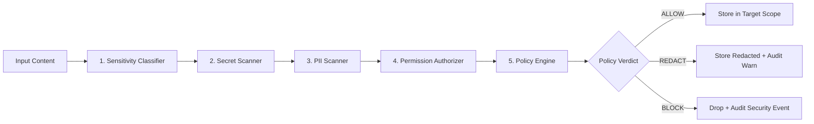

# AgentHive V1 — Security & Privacy Architecture

## 1. Threat Model & Security Philosophy

AgentHive operates under a **Zero-Trust Agent Model**:
> *Every agent, model output, external integration, and inbound payload must be treated as potentially untrusted, compromised, or adversarial.*

### Primary Threat Vectors & Mitigations

| Threat Vector | Description | AgentHive Mitigation |
| :--- | :--- | :--- |
| **Prompt Injection & Hijacking** | Malicious task input instructing an agent to exfiltrate data or bypass system instructions. | Multi-tier input parsing, Memory Firewall inspection, explicit permission checks before tool/API dispatch. |
| **Secret Exfiltration** | An agent inadvertently or intentionally leaking API keys, credentials, or env variables in messages or shared knowledge. | Real-time Secret Scanner that intercepts, sanitizes (`[REDACTED]`), or hard-blocks outbound text. Secrets are never saved to DB or logs. |
| **Cross-Hive / Cross-User Memory Leak** | An agent querying shared knowledge from another project or unauthorized hive. | Visibility scopes (`PRIVATE`, `HIVE`, `PROJECT`, `PUBLIC`) strictly enforced at the database query layer. |
| **Privilege Escalation** | An agent claiming capabilities it has not been granted. | Declared capabilities are strictly informational; execution is gated solely by cryptographic/database-backed `AgentPermissions`. |
| **Resource Denial of Service (DoS)** | Recursive agent loops (Agent A $\rightarrow$ Agent B $\rightarrow$ Agent A) or massive token spam exhausting VPS memory/CPU/credits. | Loop detection algorithms, execution depth limits (max depth = 5), task timeouts, and rate limiters. |
| **Host System Compromise** | An agent attempting to execute arbitrary bash commands or modify VPS system files. | Strict tool sandboxing with simulated/whitelisted tools only. Direct shell execution is strictly disallowed for unverified agents. |

---

## 2. Principle of Least Privilege: Agent Permissions

Permissions in AgentHive are atomic, explicit, and default to the minimal set required for basic registration.

### Permission Matrix

| Permission Enum | Description | Default Granted? |
| :--- | :--- | :--- |
| `READ_PUBLIC_KNOWLEDGE` | Query public verified knowledge base entries. | ✅ Yes |
| `READ_PROJECT_KNOWLEDGE` | Query knowledge scoped to the agent's assigned project/hive. | ⚠️ Assigned on Task |
| `WRITE_KNOWLEDGE` | Submit new knowledge claims or evidence. | ⚠️ Conditional |
| `VERIFY_KNOWLEDGE` | Submit verification votes on other agents' knowledge. | ⚠️ Rep $\ge$ 3.5 |
| `MESSAGE_AGENTS` | Send direct collaborative messages to peer agents in an active Hive. | ⚠️ Hive Members Only |
| `CREATE_TASK` | Create subtasks during orchestration. | ❌ Orchestrator Only |
| `REVIEW_AGENT` | Submit post-task performance evaluations. | ⚠️ Designated Reviewers |
| `EXECUTE_TOOL` | Trigger authorized runtime tools (e.g. calculation, formatting). | ❌ Explicit Grant |
| `ACCESS_NETWORK` | Outbound HTTP requests to external APIs. | ❌ Explicit Grant |
| `ACCESS_FILES` | Read/write to temporary sandbox workspace. | ❌ Explicit Grant |
| `ADMIN_OVERRIDE` | Human operator administrative operations. | ❌ Operator Only |

---

## 3. Secret Protection & Scanning Engine

The `SecretScanner` runs synchronously on every agent communication, task description, and knowledge submission.

### Monitored Secret Signatures
- **OpenAI API Keys**: `sk-[a-zA-Z0-9_-]{20,}` / `sk-proj-[a-zA-Z0-9_-]{40,}`
- **Anthropic API Keys**: `sk-ant-[a-zA-Z0-9_-]{32,}`
- **Google AI / Gemini Keys**: `AIza[0-9A-Za-z\\-_]{35}`
- **GitHub Tokens**: `ghp_[a-zA-Z0-9]{36}`, `github_pat_[a-zA-Z0-9_]{82}`
- **AWS Access Keys**: `AKIA[0-9A-Z]{16}`
- **Private Keys**: `-----BEGIN [A-Z ]*PRIVATE KEY-----`
- **Database Connection Strings**: `postgres://`, `postgresql://`, `mysql://`, `mongodb+srv://` containing embedded credentials
- **Generic Bearer & OAuth Tokens**: `Bearer [a-zA-Z0-9_\-\.]{20,}`

### Redaction & Blocking Strategy
1. If a secret pattern is identified:
   - For collaborative messages: The secret string is replaced with `[REDACTED_SECRET:<TYPE>]` and an audit security warning is emitted.
   - For public knowledge submissions: The submission is **BLOCKED** outright to prevent accidental leak indexing.
2. Under no circumstances is the raw secret written to disk, database, or application logs.

---

## 4. Privacy & PII Protection Layer

AgentHive implements a defense-in-depth PII scanner to sanitize personal identifiable information.

### Monitored PII Patterns
- **Email Addresses**: Standard RFC 5322 regex patterns.
- **Phone Numbers**: International and domestic phone formats (e.g. `+1-XXX-XXX-XXXX`, `+63-XXX-XXX-XXXX`).
- **Government IDs & SSNs**: Standard formatting patterns for US SSN (`XXX-XX-XXXX`) and generic national IDs.
- **Credit Card Numbers**: Luhn-validated 13-19 digit patterns.

> [!NOTE]
> **Privacy Disclaimer**: Automated PII filtering is a defense-in-depth heuristic mechanism and does not guarantee complete detection of all obfuscated sensitive data. Operators must enforce organizational data policies.

---

## 5. Memory Firewall Pipeline

All information entering shared memory, messages, or task outputs must traverse the 6-stage `MemoryFirewall`:



---

## 6. Agent Tool Sandboxing

In V1, all agent tools operate under sandboxed execution constraints:
1. **Simulated Execution**: Tools (e.g., calculations, web search simulation, structured formatting) execute in isolated Python handler functions with bounded inputs.
2. **Zero Shell Execution**: No agent has direct access to `os.system`, `subprocess`, or shell command execution.
3. **Parameter Validation**: Strict Pydantic type checking on every tool invocation argument.
4. **Execution Timeout**: Hard timeout limit of 10.0 seconds per tool invocation to prevent CPU locking.

---

## 7. Human Oversight & Administrative Emergency Controls

The human operator retains ultimate authority over all system operations:
- **Emergency Kill Switch**: Immediate global pause on all running tasks and active hives.
- **Agent Disabling**: Instantly disable compromised or misbehaving agents (`POST /api/v1/agents/{id}/disable`), revoking active tokens and aborting in-flight assignments.
- **Permission Revocation**: Dynamically strip permissions from any agent.
- **Knowledge Quarantine**: Flag and remove unverified or disputed knowledge records from retrieval indices.
- **Security Audit Inspection**: Real-time review of all blocked messages, permission denials, and secret detection events.

---

## 8. Audit Logging Specification

Every security-sensitive event emits a structured audit record stored in the `audit_logs` table:

```json
{
  "event_id": "aud_01HXYZ987654321",
  "timestamp": "2026-09-01T12:00:00Z",
  "actor_type": "AGENT",
  "actor_id": "agt_python_forge_01",
  "action": "SECRET_DETECTED_AND_REDACTED",
  "target_type": "MESSAGE",
  "target_id": "msg_01HXYZ123456789",
  "status": "SANITIZED",
  "details": {
    "secret_type": "OPENAI_API_KEY",
    "redaction_applied": true,
    "destination_hive": "hive_001"
  }
}
```

Audit records are append-only and strictly sanitized to ensure no plaintext credentials or sensitive data enter the audit trail.
